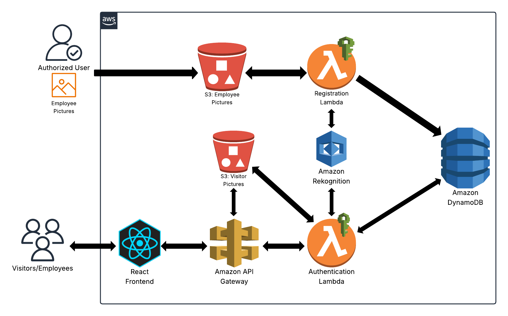

# AWS Facial Recognition


## Overview  
This AWS Facial Recognition Access Control project implements a fully serverless pipeline for onboarding and authenticating users by face. On upload of an employee photo, a Registration Lambda indexes the face into an Amazon Rekognition collection and writes the { firstName, lastName, rekognitionId } record into DynamoDB; on each visitor check, an Authentication Lambda retrieves the S3-hosted image, runs search_faces_by_image to find matches, and returns a JSON success or failure to the React frontend. The ReactJS app captures photos, PUTs them through API Gateway into S3, then invokes the authentication endpoint to display personalized greetings or denial messages. All interactions are secured by IAM roles with least-privilege policies, and CORS is fully enabled on API Gateway to support browser-based uploads and fetches.  

## Architecture  
  

1. **Registration Flow**  
- **S3 Upload Trigger**  
  Employee JPEGs land in the `akamal-employee-images` bucket.  
- **Index into Rekognition**  
  `employee_registration.py` calls `rekognition.index_faces` to add the face to the “employees” collection.  
- **Persist in DynamoDB**  
  Extracts first/last name from filename (`First_Last.jpeg`) and writes `{ rekognitionId, firstName, lastName }` to the `employee` table. 

2. **Authentication Flow**  
- **React Capture & Upload**  
  Visitor photo is captured in the browser and PUT to `akamal-visitor-images/{uuid}.jpeg` via API Gateway.  
- **Face Search**  
  `employee_authentication.py` retrieves the image, calls `rekognition.search_faces_by_image`, and loops over `FaceMatches`.  
- **Lookup & Response**  
  If a match’s `FaceId` exists in DynamoDB, returns HTTP 200 with `{ Message: "Success", firstName, lastName }`; otherwise returns HTTP 403 `{ Message: "Person Not Found" }`.
  
3. **Frontend**  
- **UI Components**  
  - File input and “Authenticate” button to select and submit JPEGs.  
  - Dynamic status message that turns green on success, red on failure.  
- **Network Logic**  
  - `fetch( PUT )` uploads binary JPEG to S3 through API Gateway.  
  - `fetch( GET )` invokes the auth endpoint, parses JSON, and updates the UI.  
- **Offline Testing**  
  Visitor test images under `src/visitors/` simulate various cases (employees vs. non-employees).
   

## Technologies  
- **AWS Lambda** (Python)  
- **Amazon Rekognition**  
- **Amazon S3**  
- **Amazon DynamoDB**  
- **API Gateway** (REST API with binary support)  
- **ReactJS** 

## Project Structure
```plaintext
AWS-Facial-Recognition/                   
├── README.md                             # Overview, setup, architecture, usage
├── employee_registration.py              # Registration Lambda code
├── employee_authentication.py            # Authentication Lambda code
├── docs/                                 
│   ├── architecture-diagram.png          # AWS flowchart
│   └── architecture-diagram.pdf          # High-res export of diagram
├── employee-images/                      # Seed data for registration
│   ├── Tim_Cook.jpeg                     # Employee test image
│   ├── Jeff_Bezos.jpeg                   # Employee test image
│   └── Sundar_Pichai.jpeg                # Employee test image
└── facial-recognition-app/               # React frontend root
    ├── package.json                      # Frontend dependencies & scripts
    ├── package-lock.json                 # Exact package versions
    ├── public/                           # Static assets & HTML
    │   ├── favicon.ico
    │   ├── index.html
    │   ├── logo192.png
    │   ├── logo512.png
    │   ├── manifest.json
    │   └── robots.txt
    └── src/                              # React source code
        ├── App.js                        # Main component & fetch logic
        ├── App.css                       # Component styling
        ├── index.js                      
        ├── index.css                     
        └── visitors/                     # Test visitor photos for UI dev
            ├── visitor1.jpeg             # React test: Sundar Pichai
            ├── visitor2.jpeg             # React test: Steve Jobs (non-employee, should output failed authentication)
            ├── visitor3.jpeg             # React test: Tim Cook
            └── visitor6.jpeg             # React test: Jeff Bezos
